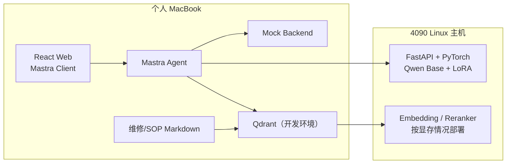
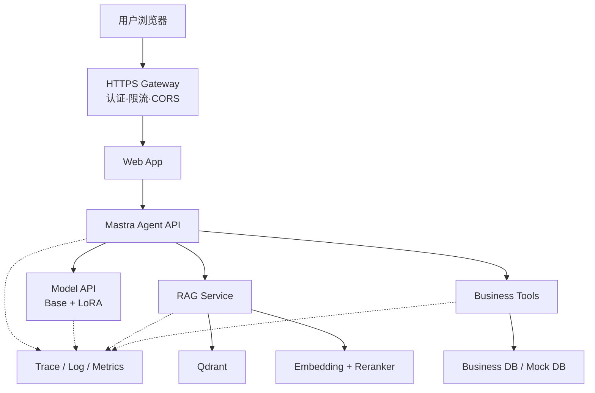

# 电商客服 AI：商业化训练、部署与前端改造指导方案

> 适用项目：`gn57-ux/qwen-customer-service-agent`
> 文档目标：明确 4090 训练主机与个人 MacBook 的职责边界，规划正式 Web 前端替代 Mastra Studio，并为后续 QLoRA、RAG、Rerank、Tools 和治理建设提供实施依据。

## 1. 结论先行

### 1.1 训练后的模型是否依赖 4090 训练主机

**不依赖原来那台具体的 4090 主机，但依赖对应的基础模型、Tokenizer、模型架构和兼容的软件运行环境。**

QLoRA 训练产物不是完整模型，而是一组 LoRA Adapter 增量权重。当前项目中的核心产物为：

```text
adapters/customer-service-smoke/adapter_model.safetensors
adapters/customer-service-smoke/adapter_config.json
```

使用时必须组合：

```text
Qwen 基础模型
+ 对应 Tokenizer / Chat Template
+ QLoRA Adapter
+ Transformers / PEFT / PyTorch 等兼容依赖
= 可运行的客服模型
```

因此：

- 4090 主机完成训练后可以关机，Adapter 不会绑定 GPU 序列号或某台服务器。
- Adapter 可以复制到另一台 NVIDIA GPU 服务器继续推理或训练。
- 不能只保留 Adapter 而丢失基础模型名称、版本和训练配置。
- 如果更换成另一种 Qwen 模型或不同架构，旧 Adapter 不能直接套用。
- 量化方式影响加载方法，但 Adapter 本身不要求必须使用 4090。

### 1.2 MacBook 能否运行训练后的模型

MacBook 可以承担项目开发、Agent、前端、文档、数据治理和部分 RAG 工作，但不建议把当前 CUDA QLoRA 推理链直接迁移到 MacBook。

原因：

- 当前代码使用 PyTorch CUDA、bitsandbytes NF4 和 `device_map={"": 0}`。
- Apple Silicon 使用 Metal/MPS，没有 NVIDIA CUDA。
- bitsandbytes 的 CUDA 4-bit 加载方式不能按当前代码原样运行。
- 即使模型能通过 MLX、llama.cpp 或 GGUF 在 Mac 上推理，也属于另一条转换和验证链路。

推荐主线：

```text
4090 Linux 主机：
  QLoRA 训练
  Base/Adapter 评测
  PyTorch + PEFT 模型推理 API
  可选 Embedding/Reranker GPU 推理

个人 MacBook：
  React Web 前端
  Mastra Agent
  Mock Backend 开发
  知识文档编写
  数据清洗与审核
  自动化测试
  Git/GitHub 管理
  可选 Qdrant 本地开发
```

Mac 本地模型属于后续优化项：

```text
Base + LoRA 合并
→ 转换为 GGUF 或 MLX 格式
→ llama.cpp / MLX 推理
→ 重新执行效果与性能评测
```

这不作为第一阶段作业的阻塞条件。

## 2. 模型资产治理

商业项目不能只记录“训练过一个 Adapter”，必须建立完整的模型清单。

建议新增：

```text
training/registry/customer-service-v2.yaml
```

内容示例：

```yaml
model_id: customer-service-v2
status: candidate

base_model:
  name: 待GPU检查后确定
  revision: 固定提交或版本号
  source: modelscope-or-huggingface

tokenizer:
  name: 与基础模型一致
  chat_template_version: v1

adapter:
  path: adapters/customer-service-v2
  version: 2.0.0
  format: peft-lora

training:
  dataset_version: customer-service-2026-08-v1
  config: configs/train-customer-service-v2.yaml
  precision: nf4-bf16

evaluation:
  report: training/reports/customer-service-v2.json
  status: pending
```

必须备份的资产：

| 资产 | GitHub | 对象存储/模型仓库 | 说明 |
|---|---|---|---|
| 训练配置 | 是 | 可选 | 必须版本化 |
| 数据集 | 脱敏后提交 | 建议 | 不提交真实隐私数据 |
| Adapter | 小版本可提交 | 推荐 | 当前约 66MB |
| 基础模型 | 否 | 模型仓库/云盘 | 体积大且受许可证约束 |
| Checkpoint | 否 | 云盘/对象存储 | 只保留必要节点 |
| 评测报告 | 是 | 可选 | 发布门禁依据 |
| Prompt | 是 | 可选 | 必须标注版本 |
| 知识库 MD | 是 | 建议 | 必须标注来源和版本 |

## 3. 推荐开发与部署拓扑

### 3.1 课程开发阶段



优点：

- 只有训练和模型推理需要 GPU 开机。
- 前端、Mastra 和文档工作可以在 Mac 上完成。
- 4090 按量关机时，仍可继续开发 UI、数据和测试。

限制：

- 4090 关机后，真实 QLoRA 回复不可用。
- 网络地址可能变化，需要通过环境变量配置模型 URL。
- 不应将没有认证的模型端口直接暴露到公网。

### 3.2 正式演示或商业部署阶段



正式部署时，MacBook 不参与生产运行。MacBook 只是开发终端；服务应运行在稳定的 Linux 环境中。

## 4. 用正式前端替代 Mastra Studio

### 4.1 定位

Mastra Studio 保留为开发和调试工具，正式用户不再直接访问 Studio。

正式调用链：

```text
用户浏览器
→ React Web
→ @mastra/client-js
→ Mastra Agent
→ QLoRA / RAG / Tools
→ 流式返回 Web
```

前端不应直接访问：

- FastAPI 模型服务；
- Qdrant；
- Embedding/Reranker；
- Mock 订单后端；
- 内部 Prompt；
- 数据库。

这样可以防止用户绕过 Agent 的安全规则和审计链路。

### 4.2 前端技术栈

```text
React
Vite
TypeScript
@mastra/client-js
TanStack Query（可选）
Zod
CSS Modules 或 Tailwind CSS
```

建议目录：

```text
web/
├── src/
│   ├── api/
│   │   └── mastra-client.ts
│   ├── components/
│   │   ├── ChatWindow.tsx
│   │   ├── MessageBubble.tsx
│   │   ├── Composer.tsx
│   │   ├── ToolStatus.tsx
│   │   ├── CitationList.tsx
│   │   ├── SafetyNotice.tsx
│   │   └── ServiceStatus.tsx
│   ├── hooks/
│   │   ├── useAgentStream.ts
│   │   └── useConversation.ts
│   ├── types/
│   │   └── chat.ts
│   ├── App.tsx
│   └── main.tsx
├── .env.example
├── package.json
└── vite.config.ts
```

### 4.3 必做页面能力

第一版只需要一个高质量客服工作台：

1. 流式对话；
2. 多轮会话；
3. 停止生成；
4. 重新发送；
5. Tool 调用状态；
6. RAG 引用来源；
7. 服务异常提示；
8. 转人工提示；
9. 示例问题；
10. 用户“有帮助/无帮助”反馈。

建议布局：

```text
┌─────────────────────────────────────────────────────────┐
│ 家电售后智能客服             模型/RAG/订单服务状态       │
├──────────────────────────────────┬──────────────────────┤
│                                  │ 本次处理过程          │
│ 用户与客服对话                    │ ✓ 识别显示器问题      │
│                                  │ ✓ 召回 20 条知识      │
│ 客服回复……                       │ ✓ Rerank Top 5       │
│                                  │ ✓ 生成安全建议        │
│ [引用 1] [引用 2]                │                      │
│                                  │ 参考来源              │
│                                  │ 显示器无信号排查      │
├──────────────────────────────────┴──────────────────────┤
│ 输入问题……                    [停止] [发送]             │
└─────────────────────────────────────────────────────────┘
```

### 4.4 前后端事件协议

Mastra 返回给前端的事件需要标准化：

```ts
type AgentEvent =
  | { type: "message.delta"; content: string }
  | { type: "tool.started"; toolName: string; callId: string }
  | { type: "tool.completed"; toolName: string; callId: string }
  | { type: "retrieval.completed"; candidateCount: number; topK: number }
  | { type: "citation"; source: Citation }
  | { type: "safety.warning"; message: string }
  | { type: "message.completed"; traceId: string }
  | { type: "error"; code: string; message: string };
```

前端展示 Tool 状态，但不展示模型的内部思维过程。

引用结构：

```ts
interface Citation {
  documentId: string;
  documentVersion: string;
  title: string;
  section: string;
  score?: number;
}
```

## 5. 前端替代 Studio 后的安全边界

### 5.1 浏览器只连接 Mastra

生产环境只公开一个受控入口：

```text
https://customer.example.com/api/agent
```

内部端口：

```text
4111  Mastra Agent
8000  Model API
8001  Mock/Business Backend
6333  Qdrant
```

内部端口不直接暴露公网。

### 5.2 必须增加

- API Key/JWT 或演示账号；
- CORS 白名单；
- 请求体大小限制；
- 单用户并发限制；
- Rate Limit；
- 请求超时；
- `trace_id`；
- 日志隐私脱敏；
- Tool 输入 Schema 校验；
- 错误信息转换，禁止向浏览器返回服务器堆栈。

## 6. 4090 与 MacBook 的工作分配

| 工作 | 4090 Linux | MacBook |
|---|---:|---:|
| 环境检查 | 必须 | 不适用 |
| 下载基础模型 | 推荐 | 不推荐 |
| 20 条 Smoke QLoRA | 必须 | 不推荐 |
| 500～1000 条正式 QLoRA | 必须 | 不推荐 |
| Base/QLoRA 批量评测 | 推荐 | 可做结果分析 |
| FastAPI GPU 推理 | 必须 | 只做 API 调用 |
| 数据设计和审核 | 可做 | 推荐 |
| 维修/SOP Markdown | 可做 | 推荐 |
| Mastra Agent 开发 | 可做 | 推荐 |
| React 前端 | 可做 | 推荐 |
| Mock Backend | 可做 | 推荐 |
| Qdrant 开发环境 | 可做 | 可以 |
| Embedding/Reranker | 推荐 | 可用小模型验证 |
| Git/GitHub/文档 | 可做 | 推荐 |

## 7. 断电、关机与恢复

4090 按量实例关机前必须保存：

```text
/data/models          基础模型
/data/checkpoints     训练 Checkpoint
/data/adapters        最终 Adapter
/data/evaluation      评测结果
/data/hf-cache        模型缓存（按空间决定）
```

代码、配置、脱敏数据和报告提交 GitHub。

建议增加：

```text
scripts/
├── check-environment.sh
├── bootstrap-linux.sh
├── train-smoke.sh
├── train-production.sh
├── evaluate.sh
├── export-adapter.sh
└── start-services.sh
```

恢复过程：

```text
新开 4090 实例
→ 挂载持久化盘
→ 拉取 GitHub 代码
→ 安装锁定依赖
→ 检查基础模型与 Adapter
→ 启动 Model API
→ 执行健康检查
→ Mac 上的 Mastra 重新连接模型 URL
```

## 8. 环境变量规划

根目录 `.env.example` 建议升级为：

```dotenv
# Model API
MODEL_API_URL=http://gpu-host:8000/v1
MODEL_API_KEY=change-me
MODEL_NAME=customer-service-qwen-v2

# Model runtime
BASE_MODEL_PATH=/data/models/qwen
ADAPTER_PATH=/data/adapters/customer-service-v2
MAX_INPUT_TOKENS=4096
MAX_OUTPUT_TOKENS=512
MAX_CONCURRENCY=1

# Mastra
MASTRA_API_URL=http://localhost:4111
AGENT_ID=customerServiceAgent

# Mock backend
MOCK_BACKEND_URL=http://localhost:8001

# RAG
QDRANT_URL=http://localhost:6333
QDRANT_COLLECTION=customer_service_knowledge
EMBEDDING_API_URL=http://gpu-host:8002
RERANK_API_URL=http://gpu-host:8003

# Web
VITE_MASTRA_API_URL=http://localhost:4111

# Security
APP_API_KEY=change-me
ALLOWED_ORIGINS=http://localhost:5173
```

真实密钥不提交 GitHub。

## 9. 商业治理要求

### 9.1 版本绑定

一次发布必须绑定：

```text
代码版本
+ 基础模型版本
+ Adapter 版本
+ 数据集版本
+ Prompt 版本
+ 知识库版本
+ Embedding/Reranker 版本
+ 自动评测报告
```

### 9.2 请求追踪

每次请求记录：

- `trace_id`；
- Agent 版本；
- 模型与 Adapter 版本；
- Tool 名称、状态和延迟；
- RAG 文档 ID 和版本；
- Rerank 前后结果；
- Token 数和总延迟；
- 是否命中安全策略；
- 用户反馈。

不记录完整思维过程，不在普通日志保存完整个人隐私数据。

### 9.3 发布门禁

至少比较：

```text
Base Model
QLoRA
QLoRA + RAG
QLoRA + RAG + Tools
```

关键目标：

| 指标 | 首个候选目标 |
|---|---:|
| 客服 SOP 合规率 | ≥ 90% |
| Tool 选择正确率 | ≥ 95% |
| Tool 参数正确率 | ≥ 95% |
| RAG Hit@5 | ≥ 85% |
| 引用正确率 | ≥ 90% |
| 无依据拒答率 | ≥ 90% |
| 高风险维修拦截率 | 100% |

目标必须通过固定测试集实测，不能直接写成已实现结果。

## 10. 分阶段实施

### Phase 0：冻结旧版

- 给旧版本打课程原型标签；
- 保留旧 Adapter、配置和训练结果；
- 不在旧版上继续堆功能。

### Phase 1：4090 Linux 训练基线

- 检查 GPU/CUDA/Python/磁盘；
- 确认新基础模型；
- 安装 LLaMA Factory；
- 完成 20 条 Smoke Training；
- 重载 Adapter 并验证。

验收通过后再进入正式数据训练。

### Phase 2：正式数据与评测

- 建设 500～1000 条数据；
- 固定训练/验证/测试集；
- 正式 QLoRA；
- 对比 Base 和 QLoRA；
- 注册候选 Adapter。

### Phase 3：模型 API 重构

- Linux 配置化；
- 真正逐 Token 流式；
- 健康检查；
- 并发、超时、认证、日志；
- OpenAI 协议测试。

### Phase 4：Mastra 与 Tools

- 接回 `queryOrderTool`；
- 增加 Tool Schema、超时和审计；
- 完成 Agent 路由评测。

### Phase 5：RAG 与 Rerank

- 冰箱、彩电、显示器维修 MD；
- 客服 SOP、退款和物流规则；
- Qdrant 入库 Workflow；
- Embedding；
- 独立 Reranker；
- 引用与低分拒答。

### Phase 6：正式前端

- 创建 React + Vite 工程；
- 接入 `@mastra/client-js`；
- 流式对话；
- Tool 状态；
- RAG 引用；
- 用户反馈和错误处理。

### Phase 7：商业化质量闭环

- 四组对比评测；
- 安全与 Prompt Injection 测试；
- Trace 和指标；
- 发布门禁；
- 回滚演练；
- 完整部署及运维文档。

## 11. 第一版交付标准

第一版完成应满足：

1. 4090 上完成可复现 QLoRA 训练；
2. Adapter 能在新 GPU 实例上重新加载；
3. MacBook 无需运行 CUDA 模型即可开发前端和 Agent；
4. Web 前端通过 Mastra Client 完成流式聊天；
5. 用户不再直接使用 Mastra Studio；
6. Agent 能正确调用订单 Tool；
7. Agent 能完成 RAG + Rerank；
8. 回复展示可追溯引用；
9. 高风险维修问题被拦截；
10. 四组评测结果可复现；
11. 模型、数据、Prompt、知识库版本可追踪；
12. 云端实例关机后，关键资产能够恢复。

## 12. 最终建议

本项目不应选择“训练和所有服务都依赖个人电脑”，也不应选择“所有开发都在昂贵 GPU 上完成”。

推荐模式：

```text
4090 是模型算力节点：
负责训练、批量评测和 PyTorch 推理。

MacBook 是开发与控制节点：
负责前端、Mastra、数据、知识、测试和 Git 管理。

正式环境是 Linux 服务集群：
MacBook 不参与生产运行，所有调用通过受控 API 完成。
```

这样既能控制按量 GPU 成本，也能保证训练资产可迁移、前端可独立开发，并为后续商业化部署、治理和审计留下清晰边界。
