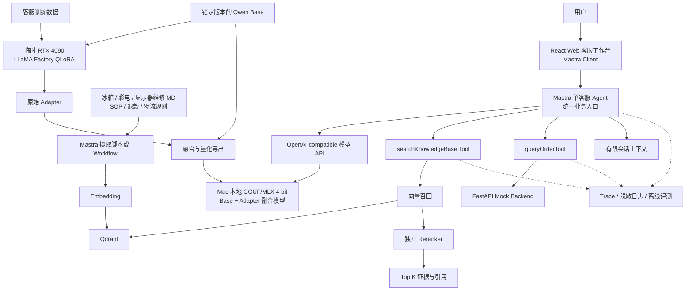
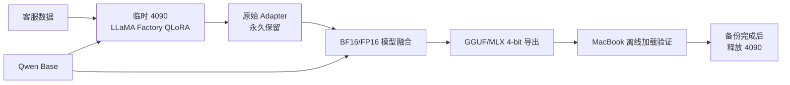
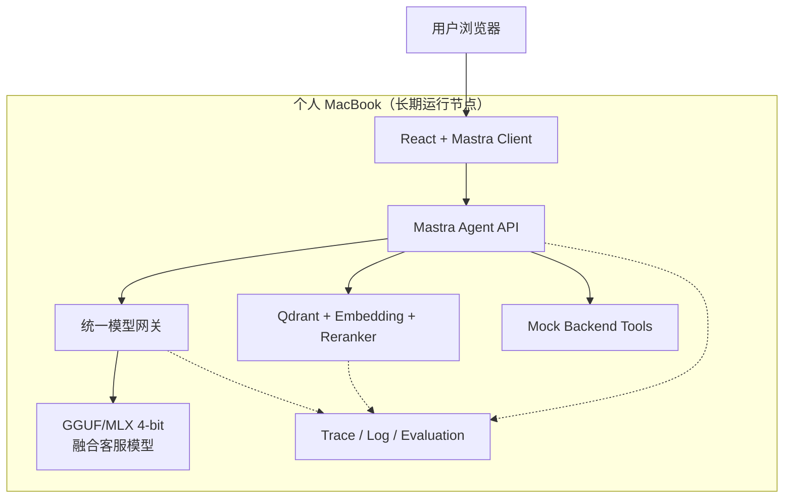

# 电商客服 AI：QLoRA、FastAPI、Mastra Agent、RAG 与前端交付指导方案

> 适用项目：`gn57-ux/qwen-customer-service-agent`
> 方案版本：2.0
> 文档目标：以两次课程作业为强制范围，结合两份设计方案和参考架构，明确临时 4090 与个人 MacBook 的职责边界，并给出可以逐步验收的正式项目实施方案。

## 0. 最终规划基线

本章是项目实施时的最高优先级基线。后续章节用于解释技术细节；出现理解差异时，以本章的范围和顺序为准。

### 0.1 项目定位

项目最终交付为：

> 一套运行在个人 MacBook 上的家电售后智能客服系统。系统使用在临时 4090 上完成 QLoRA 训练并导出的本地 Qwen 模型，通过 Mastra Agent 编排模型、RAG 和订单 Tool，由 React 前端提供统一的流式对话入口。

业务范围包括：

- 电商订单查询与不存在订单处理；
- 冰箱、彩电、显示器维修知识问答；
- 客服 SOP、退款规则、物流规则问答；
- 高风险维修操作警告、无依据拒答和人工升级；
- 回答所依据的知识来源与 Tool 执行状态展示。

系统各部分的职责必须保持分离：

```text
System Prompt：身份、规则、安全边界和工具使用原则
QLoRA：客服语气、回答结构、业务处理流程和拒答习惯
RAG：维修知识、SOP、退款规则、物流规则等可更新事实
Tool/API：订单、物流、退款等实时或模拟业务状态
Mastra Agent：意图判断、工具路由、上下文和最终回复编排
Web：面向用户的对话、引用、执行状态和异常提示
```

核心原则：

```text
LoRA 管“怎么答”
RAG 管“依据什么事实回答”
Tool 管“实时业务状态”
Prompt 管“允许做什么”
Agent 管“何时调用谁”
```

### 0.2 作业要求逐项映射

| 作业要求 | 本项目实现 | 验收证据 | 优先级 |
|---|---|---|---|
| 训练一个 QLoRA 模型 | Linux + LLaMA Factory，先 20 条 Smoke，再 500～1000 条正式数据 | 配置、日志、loss、Adapter、重载测试 | 必做 |
| FastAPI + PyTorch 封装 QLoRA | 4090 上保留 PyTorch + PEFT 服务，兼容 `/v1/chat/completions` | health、models、非流式/流式接口测试 | 必做 |
| Mastra/LangChain Agent 接入 QLoRA | 采用 Mastra 单 Agent，对接 OpenAI-compatible 模型协议 | Agent 对话和调用日志 | 必做 |
| 接入 Mock 后端完成 Tools | 延续订单 Mock API 和 `queryOrderTool`，覆盖 ORD1001～1003、ORD9999 | Tool 自动选择、参数与异常测试 | 必做 |
| 边界条件训练 | 在正式数据中加入无订单号、未知事实、隐私、高风险维修、越权承诺等样本 | 固定边界测试集 | 增强项，但纳入正式数据 |
| 冰箱、彩电、显示器维修 MD | 三类设备分别提供结构化 Markdown，并补充安全说明 | 文档清单与内容审查 | 必做 |
| 向量数据库、向量模型和 Mastra 入库 | Qdrant + 中文 Embedding + Mastra 摄取脚本/Workflow | 可重复清库、入库、检索 | 必做 |
| Agent 接入 RAG 且必须 Rerank | 多召回候选，再使用独立 Reranker 精排后返回 Top K | Rerank 前后排名及引用测试 | 必做 |
| 维修经验保存为 MD | `knowledge/experience/` 保存经过审核的案例经验 | 至少一组可检索经验文档 | 选修 |
| 底座 + LoRA + 向量数据库润色 | RAG 先提供事实，融合后的 QLoRA 模型按客服 SOP 组织答案 | 端到端维修问答 | 必做 |
| 前端调用 Mastra 接口 | React + Vite + TypeScript + `@mastra/client-js` | 浏览器流式对话演示 | 必做 |

### 0.3 最终系统架构



与参考架构相比，本项目保留：

- 统一 Web 工作台；
- Mastra 单 Agent 客服主线；
- 本地模型、Embedding、Reranker 和 Qdrant；
- Markdown 摄取、向量召回、精排和引用；
- 模型资产、Trace、审计、评测和回归闭环；
- Adapter 融合后在 Apple Silicon 上长期推理。

第一版明确不实现：

- LangGraph 多 Agents 专家池；
- Candidate Answers、Debate 和 Arbiter 仲裁；
- Blackboard 复杂共享状态；
- Web Search 自动降级；
- 独立的模型评测、治理、运维或知识库管理页面。

这些能力可以作为商业化演进方向，但不进入本次作业的关键路径。

### 0.4 硬件与运行边界

```text
临时 RTX 4090：
  环境检查、模型下载、Smoke Training、正式 QLoRA、
  Base/QLoRA 评测、FastAPI + PyTorch + PEFT 作业验收、
  Adapter 保存、模型融合、GGUF/MLX 导出。

MacBook Pro M5 32GB / 1TB：
  长期模型推理、统一模型 API、Mastra Agent、Qdrant、
  Embedding、Reranker、Mock API、React 前端、测试与文档。
```

Adapter 不依赖某一台 4090，但依赖精确匹配的基础模型、Tokenizer、Chat Template 和模型架构。长期运行时使用：

```text
精确版本 Base + Adapter
→ 融合模型
→ GGUF 或 MLX 4-bit
→ Mac 本地推理服务
```

未经 Mac 离线加载、固定测试集和端到端联调验证，不释放临时 4090。

### 0.5 RAG 的正式实现口径

课程明确要求 Rerank，因此不采用“仅向量相似度加权后排序”冒充模型重排。第一版管道为：

```text
Markdown 结构化切分
→ Embedding
→ Qdrant 向量召回 Top 20
→ 独立 Reranker 对 Query/Chunk 相关性打分
→ Top 5
→ 阈值判断
→ 携带来源和文档版本交给模型生成
```

首版可选的增强项：

```text
向量召回 + BM25
→ RRF 融合
→ 独立 Reranker
```

混合检索能对应参考架构中的“向量 + BM25 + RRF”，但只有在纯向量检索验收通过后再增加，避免阻塞作业主线。

知识库至少包含：

```text
knowledge/repair/refrigerator.md
knowledge/repair/television.md
knowledge/repair/monitor.md
knowledge/policies/customer-service-sop.md
knowledge/policies/refund-policy.md
knowledge/policies/logistics-policy.md
knowledge/experience/*.md        # 选修
```

每个知识块需要携带：

```text
document_id、document_version、title、section、domain、
source、updated_at、risk_level、text
```

### 0.6 Agent 路由规则

第一版使用单 Agent，不额外建设多 Agent 系统：

```text
订单号 + 订单/物流/退款状态
→ queryOrderTool

冰箱/彩电/显示器维修、SOP、退款规则、物流规则
→ searchKnowledgeBase
→ Rerank
→ 引用知识回答

普通客服表达或流程引导
→ 本地 QLoRA 模型

触电、冒烟、燃气/制冷剂、拆机、高压部件等风险
→ 立即停止操作提示
→ 断电/远离危险
→ 建议联系专业售后或人工客服

订单不存在、证据不足、Tool 超时、RAG 低分
→ 明确说明无法确认
→ 不编造
→ 给出补充信息或人工处理路径
```

### 0.7 前端范围

作业只建设一个正式客服页面，不建设后台页面。该页面需要覆盖不同状态：

1. 空白欢迎与示例问题；
2. 维修 RAG 对话与引用；
3. 订单 Tool 查询与执行状态；
4. 高风险维修警告；
5. 模型、RAG 或 Tool 服务异常。

页面布局：

```text
左侧：新建会话、最近会话
中间：流式消息、引用、输入框、发送/停止
右侧：响应模式、Tool 状态、召回与 Rerank 摘要、来源
```

前端可以展示可验证的处理结果，但不得展示隐藏思维过程、完整内部 Prompt、原始 Tool JSON 或敏感日志。

### 0.8 评测与治理边界

评测是项目质量验收，不是额外页面。使用固定测试集和脚本生成 JSON/Markdown 报告：

| 对比组 | 主要验证内容 |
|---|---|
| Base Model | 原始语言和指令能力 |
| QLoRA | 客服 SOP、语气、边界改善 |
| QLoRA + RAG | 维修与政策事实、引用和低分拒答 |
| QLoRA + RAG + Tools | 实时数据查询、Tool 选择和异常处理 |

最小治理闭环包括：

- 模型、Adapter、数据集、Prompt、知识库、Embedding、Reranker版本绑定；
- `trace_id` 贯穿 Web、Agent、RAG、Tool 和模型 API；
- 记录延迟、Tool 状态、引用 ID、Rerank 结果和安全策略命中；
- 订单号、手机号等敏感信息脱敏；
- 用户反馈转为待审核样本，不能自动进入下一轮训练；
- 新版本必须通过固定回归集，失败时回滚模型、Prompt或知识库版本。

### 0.9 分阶段执行门禁

严格执行“当前阶段验证成功，才进入下一阶段”：

| 阶段 | 工作 | 通过条件 |
|---|---|---|
| 0. 冻结 V1 | 保存旧代码、20条数据、旧Adapter和结果 | 可复现旧演示，不覆盖旧资产 |
| 1. 设备检查 | 检查4090显存、CUDA、驱动、Python、Linux和磁盘 | 输出环境报告，未通过不下载模型 |
| 2. 锁定模型 | 根据4090训练能力和Mac 32GB推理能力选择Qwen 7B/8B候选，4B回退 | 固定模型名、revision、许可证和校验信息 |
| 3. Smoke训练 | 加载Base并运行20条QLoRA | loss、Adapter保存和重载推理全部成功 |
| 4. 数据工程 | 建设500～1000条并划分train/validation/test | 去重、脱敏、类别覆盖、无测试泄漏 |
| 5. 正式训练 | 完成QLoRA和Base/QLoRA对比 | 报告可复现，候选Adapter注册 |
| 6. 模型迁移 | 融合并导出GGUF或MLX 4-bit | Mac断网也能加载并通过固定测试题 |
| 7. 服务恢复 | 验收4090 PyTorch接口，并在Mac保持同一OpenAI协议 | health、models、chat和stream测试通过 |
| 8. Agent与Tool | 接回Mastra和订单Mock Tool | 四个订单用例和Tool异常用例通过 |
| 9. RAG与Rerank | 文档摄取、召回、精排、引用、低分拒答 | 三类维修问题均有正确证据 |
| 10. Web | Mastra Client正式页面 | 五种页面状态和流式调用通过 |
| 11. 总验收 | 四组评测、安全回归、备份和启动文档 | Mac独立完成端到端演示 |

### 0.10 第一版完成定义

只有同时满足以下条件，项目才算完成：

- 4090 上的 QLoRA 训练和 FastAPI + PyTorch + PEFT 封装可复现；
- 原始 Adapter 与精确 Base 版本绑定并完成双份备份；
- Mac 在 4090 释放后可以长期运行融合量化模型；
- Mastra Agent 可以稳定选择模型、RAG 或订单 Tool；
- 冰箱、彩电、显示器文档通过 Mastra 摄取到向量库；
- RAG 明确使用 Reranker，回答提供可追踪引用；
- React 前端通过 `@mastra/client-js` 调用 Mastra 流式接口；
- ORD1001、ORD1002、ORD1003、ORD9999 与异常场景通过；
- 高风险维修、证据不足、Tool失败时不编造；
- 四组对比评测输出可复现的 Markdown 报告；
- 提供 Mac 一键启动、停止、健康检查、数据重建和恢复说明。

## 1. 结论先行

### 1.1 训练后的模型是否依赖 4090 训练主机

**不依赖原来那台具体的 4090 主机，但依赖对应的基础模型、Tokenizer、模型架构和兼容的软件运行环境。**

QLoRA 训练产物不是完整模型，而是一组 LoRA Adapter 增量权重。当前项目中的核心产物为：

```text
adapters/customer-service-smoke/adapter_model.safetensors
adapters/customer-service-smoke/adapter_config.json
```

使用时必须组合：

```text
Qwen 基础模型
+ 对应 Tokenizer / Chat Template
+ QLoRA Adapter
+ Transformers / PEFT / PyTorch 等兼容依赖
= 可运行的客服模型
```

因此：

- 4090 主机完成训练后可以关机，Adapter 不会绑定 GPU 序列号或某台服务器。
- Adapter 可以复制到另一台 NVIDIA GPU 服务器继续推理或训练。
- 不能只保留 Adapter 而丢失基础模型名称、版本和训练配置。
- 如果更换成另一种 Qwen 模型或不同架构，旧 Adapter 不能直接套用。
- 量化方式影响加载方法，但 Adapter 本身不要求必须使用 4090。

### 1.2 已确认的资源约束

本项目只有两类计算资源：

```text
1 台个人 Apple Silicon MacBook：长期持有、长期运行
1 台临时 RTX 4090 Linux 实例：按量使用、训练完成后释放
```

因此，项目不能把 4090 设计为长期在线的推理服务器。**基础模型的最终选择不仅取决于 4090 能否训练，还必须取决于 MacBook 的统一内存能否长期运行融合后的量化模型。**

已完成的 MacBook 检查结果：

```text
芯片：Apple M5
统一内存：32GB
架构：arm64
可用磁盘：约 672GiB（检查时）
```

模型选择原则：

| MacBook 统一内存 | 建议主线 |
|---|---|
| 16GB | Qwen 3B/4B，GGUF/MLX 4-bit |
| 24GB | Qwen 4B 最稳，7B/8B 需要实测 |
| 32GB | Qwen 7B/8B 4-bit |
| 48GB 及以上 | Qwen 8B 4-bit，可评估更大模型 |

据此，本项目正式将 **Qwen 7B/8B 级模型 + GGUF/MLX 4-bit** 作为候选主线，将 4B 作为性能或兼容性回退。具体模型名称和 revision 在 4090 环境检查完成后锁定，锁定前不下载模型。

### 1.3 MacBook 能否运行训练后的模型

MacBook 可以承担项目开发、Agent、前端、文档、数据治理和部分 RAG 工作，但不建议把当前 CUDA QLoRA 推理链直接迁移到 MacBook。

原因：

- 当前代码使用 PyTorch CUDA、bitsandbytes NF4 和 `device_map={"": 0}`。
- Apple Silicon 使用 Metal/MPS，没有 NVIDIA CUDA。
- bitsandbytes 的 CUDA 4-bit 加载方式不能按当前代码原样运行。
- 即使模型能通过 MLX、llama.cpp 或 GGUF 在 Mac 上推理，也属于另一条转换和验证链路。

已经确认的最终主线：

```text
临时 4090 Linux 主机：
  QLoRA 训练
  Base/Adapter 评测
  FastAPI + PyTorch + PEFT 原始链路验收
  永久保存原始 Adapter
  Base + Adapter 融合
  导出 GGUF 或 MLX 4-bit
  在释放实例前把全部必要资产下载到 MacBook

个人 MacBook：
  长期运行融合后的 GGUF/MLX 客服模型
  本地 OpenAI 兼容模型接口
  React Web 前端
  Mastra Agent
  Mock Backend
  Qdrant + RAG + Rerank
  知识文档编写
  数据清洗与审核
  自动化测试
  Git/GitHub 管理
```

Mac 本地模型不再是后续优化项，而是本项目能够在 4090 释放后继续工作的必选交付物：

```text
Base + LoRA 合并
→ 转换为 GGUF 或 MLX 格式
→ llama.cpp / MLX 推理
→ 重新执行效果与性能评测
```

未经 MacBook 离线加载验证，不允许释放 4090 实例。

## 2. 模型资产治理

商业项目不能只记录“训练过一个 Adapter”，必须建立完整的模型清单。

建议新增：

```text
training/registry/customer-service-v2.yaml
```

内容示例：

```yaml
model_id: customer-service-v2
status: candidate

base_model:
  name: 待GPU检查后确定
  revision: 固定提交或版本号
  source: modelscope-or-huggingface

tokenizer:
  name: 与基础模型一致
  chat_template_version: v1

adapter:
  path: adapters/customer-service-v2
  version: 2.0.0
  format: peft-lora

training:
  dataset_version: customer-service-2026-08-v1
  config: configs/train-customer-service-v2.yaml
  precision: nf4-bf16

evaluation:
  report: training/reports/customer-service-v2.json
  status: pending
```

必须备份的资产：

| 资产 | GitHub | 对象存储/模型仓库 | 说明 |
|---|---|---|---|
| 训练配置 | 是 | 可选 | 必须版本化 |
| 数据集 | 脱敏后提交 | 建议 | 不提交真实隐私数据 |
| Adapter | 小版本可提交 | 推荐 | 当前约 66MB |
| 基础模型 | 否 | 模型仓库/云盘 | 体积大且受许可证约束 |
| Checkpoint | 否 | 云盘/对象存储 | 只保留必要节点 |
| 评测报告 | 是 | 可选 | 发布门禁依据 |
| Prompt | 是 | 可选 | 必须标注版本 |
| 知识库 MD | 是 | 建议 | 必须标注来源和版本 |

## 3. 推荐开发与部署拓扑

### 3.1 临时训练与迁移阶段



4090 在此阶段只是“训练与模型加工厂”，不是生产依赖。

### 3.2 4090 释放后的长期运行阶段



课程交付和个人演示阶段由 MacBook 承担全部长期运行服务。MacBook 关机时服务会停止，这是当前资源条件下接受的限制。若未来商业上线，再把相同接口迁移到稳定的 Linux/GPU 服务，不改变前端和 Agent 的调用协议。

## 4. 用正式前端替代 Mastra Studio

### 4.1 定位

Mastra Studio 保留为开发和调试工具，正式用户不再直接访问 Studio。

正式调用链：

```text
用户浏览器
→ React Web
→ @mastra/client-js
→ Mastra Agent
→ QLoRA / RAG / Tools
→ 流式返回 Web
```

前端不应直接访问：

- FastAPI 模型服务；
- Qdrant；
- Embedding/Reranker；
- Mock 订单后端；
- 内部 Prompt；
- 数据库。

这样可以防止用户绕过 Agent 的安全规则和审计链路。

### 4.2 前端技术栈

```text
React
Vite
TypeScript
@mastra/client-js
TanStack Query（可选）
Zod
CSS Modules 或 Tailwind CSS
```

建议目录：

```text
web/
├── src/
│   ├── api/
│   │   └── mastra-client.ts
│   ├── components/
│   │   ├── ChatWindow.tsx
│   │   ├── MessageBubble.tsx
│   │   ├── Composer.tsx
│   │   ├── ToolStatus.tsx
│   │   ├── CitationList.tsx
│   │   ├── SafetyNotice.tsx
│   │   └── ServiceStatus.tsx
│   ├── hooks/
│   │   ├── useAgentStream.ts
│   │   └── useConversation.ts
│   ├── types/
│   │   └── chat.ts
│   ├── App.tsx
│   └── main.tsx
├── .env.example
├── package.json
└── vite.config.ts
```

### 4.3 必做页面能力

第一版只需要一个高质量客服工作台：

1. 流式对话；
2. 多轮会话；
3. 停止生成；
4. 重新发送；
5. Tool 调用状态；
6. RAG 引用来源；
7. 服务异常提示；
8. 转人工提示；
9. 示例问题；
10. 用户“有帮助/无帮助”反馈。

建议布局：

```text
┌─────────────────────────────────────────────────────────┐
│ 家电售后智能客服             模型/RAG/订单服务状态       │
├──────────────────────────────────┬──────────────────────┤
│                                  │ 本次处理过程          │
│ 用户与客服对话                    │ ✓ 识别显示器问题      │
│                                  │ ✓ 召回 20 条知识      │
│ 客服回复……                       │ ✓ Rerank Top 5       │
│                                  │ ✓ 生成安全建议        │
│ [引用 1] [引用 2]                │                      │
│                                  │ 参考来源              │
│                                  │ 显示器无信号排查      │
├──────────────────────────────────┴──────────────────────┤
│ 输入问题……                    [停止] [发送]             │
└─────────────────────────────────────────────────────────┘
```

### 4.4 前后端事件协议

Mastra 返回给前端的事件需要标准化：

```ts
type AgentEvent =
  | { type: "message.delta"; content: string }
  | { type: "tool.started"; toolName: string; callId: string }
  | { type: "tool.completed"; toolName: string; callId: string }
  | { type: "retrieval.completed"; candidateCount: number; topK: number }
  | { type: "citation"; source: Citation }
  | { type: "safety.warning"; message: string }
  | { type: "message.completed"; traceId: string }
  | { type: "error"; code: string; message: string };
```

前端展示 Tool 状态，但不展示模型的内部思维过程。

引用结构：

```ts
interface Citation {
  documentId: string;
  documentVersion: string;
  title: string;
  section: string;
  score?: number;
}
```

## 5. 前端替代 Studio 后的安全边界

### 5.1 浏览器只连接 Mastra

生产环境只公开一个受控入口：

```text
https://customer.example.com/api/agent
```

内部端口：

```text
4111  Mastra Agent
8000  Model API
8001  Mock/Business Backend
6333  Qdrant
```

内部端口不直接暴露公网。

### 5.2 必须增加

- API Key/JWT 或演示账号；
- CORS 白名单；
- 请求体大小限制；
- 单用户并发限制；
- Rate Limit；
- 请求超时；
- `trace_id`；
- 日志隐私脱敏；
- Tool 输入 Schema 校验；
- 错误信息转换，禁止向浏览器返回服务器堆栈。

## 6. 4090 与 MacBook 的工作分配

| 工作 | 4090 Linux | MacBook |
|---|---:|---:|
| 环境检查 | 必须 | 不适用 |
| 下载基础模型 | 推荐 | 不推荐 |
| 20 条 Smoke QLoRA | 必须 | 不推荐 |
| 500～1000 条正式 QLoRA | 必须 | 不推荐 |
| Base/QLoRA 批量评测 | 必须 | 做结果分析 |
| FastAPI + PyTorch 原始验收 | 必须 | 保存代码与验收证据 |
| 保存原始 Adapter | 必须 | 必须备份 |
| Base + Adapter 融合 | 必须 | 不推荐 |
| GGUF/MLX 导出 | 必须 | 必须验证 |
| 长期本地模型推理 | 临时验证 | 必须 |
| 数据设计和审核 | 可做 | 推荐 |
| 维修/SOP Markdown | 可做 | 推荐 |
| Mastra Agent 开发 | 可做 | 推荐 |
| React 前端 | 可做 | 推荐 |
| Mock Backend | 可做 | 推荐 |
| Qdrant | 可做 | 必须 |
| Embedding/Reranker | 可加速验证 | 必须使用适合本机的小模型 |
| Git/GitHub/文档 | 可做 | 推荐 |

## 7. 断电、关机与恢复

4090 按量实例关机前必须保存：

```text
/data/models          基础模型
/data/checkpoints     训练 Checkpoint
/data/adapters        最终 Adapter
/data/merged-models   BF16/FP16 融合模型
/data/exports         GGUF/MLX 量化模型
/data/evaluation      评测结果
/data/hf-cache        模型缓存（按空间决定）
```

代码、配置、脱敏数据和报告提交 GitHub。原始 Adapter、融合模型和本地量化模型至少复制两份：MacBook 本地一份，外置盘或对象存储一份。

建议增加：

```text
scripts/
├── check-environment.sh
├── bootstrap-linux.sh
├── train-smoke.sh
├── train-production.sh
├── evaluate.sh
├── export-adapter.sh
├── merge-adapter.sh
├── export-gguf.sh
├── export-mlx.sh
├── verify-artifacts.sh
└── start-services.sh
```

释放 4090 前的强制检查：

```text
原始 Adapter 可以重新加载
→ Base/Adapter 评测报告已保存
→ BF16/FP16 融合成功
→ GGUF 或 MLX 4-bit 导出成功
→ MacBook 断开 4090 后仍能独立回答固定测试题
→ 模型 API、Mastra、RAG、Tools 联调成功
→ 所有资产完成双重备份
→ 最后释放 4090
```

## 8. 环境变量规划

根目录 `.env.example` 建议升级为：

```dotenv
# Model API（MacBook 长期运行）
MODEL_API_URL=http://localhost:8000/v1
MODEL_API_KEY=change-me
MODEL_NAME=customer-service-qwen-v2

# Mac local runtime
LOCAL_MODEL_FORMAT=gguf
LOCAL_MODEL_PATH=/Users/your-name/models/customer-service-q4_k_m.gguf
LOCAL_MODEL_BACKEND=llama-cpp
MAX_INPUT_TOKENS=4096
MAX_OUTPUT_TOKENS=512
MAX_CONCURRENCY=1

# Temporary 4090 training/runtime
TRAINING_BASE_MODEL_PATH=/data/models/qwen
TRAINING_ADAPTER_PATH=/data/adapters/customer-service-v2

# Mastra
MASTRA_API_URL=http://localhost:4111
AGENT_ID=customerServiceAgent

# Mock backend
MOCK_BACKEND_URL=http://localhost:8001

# RAG
QDRANT_URL=http://localhost:6333
QDRANT_COLLECTION=customer_service_knowledge
EMBEDDING_API_URL=http://localhost:8002
RERANK_API_URL=http://localhost:8003

# Web
VITE_MASTRA_API_URL=http://localhost:4111

# Security
APP_API_KEY=change-me
ALLOWED_ORIGINS=http://localhost:5173
```

真实密钥不提交 GitHub。

## 9. 商业治理要求

### 9.1 版本绑定

一次发布必须绑定：

```text
代码版本
+ 基础模型版本
+ Adapter 版本
+ 数据集版本
+ Prompt 版本
+ 知识库版本
+ Embedding/Reranker 版本
+ 自动评测报告
```

### 9.2 请求追踪

每次请求记录：

- `trace_id`；
- Agent 版本；
- 模型与 Adapter 版本；
- Tool 名称、状态和延迟；
- RAG 文档 ID 和版本；
- Rerank 前后结果；
- Token 数和总延迟；
- 是否命中安全策略；
- 用户反馈。

不记录完整思维过程，不在普通日志保存完整个人隐私数据。

### 9.3 发布门禁

至少比较：

```text
Base Model
QLoRA
QLoRA + RAG
QLoRA + RAG + Tools
```

关键目标：

| 指标 | 首个候选目标 |
|---|---:|
| 客服 SOP 合规率 | ≥ 90% |
| Tool 选择正确率 | ≥ 95% |
| Tool 参数正确率 | ≥ 95% |
| RAG Hit@5 | ≥ 85% |
| 引用正确率 | ≥ 90% |
| 无依据拒答率 | ≥ 90% |
| 高风险维修拦截率 | 100% |

目标必须通过固定测试集实测，不能直接写成已实现结果。

## 10. 分阶段实施

### Phase 0：冻结旧版

- 给旧版本打课程原型标签；
- 保留旧 Adapter、配置和训练结果；
- 不在旧版上继续堆功能。

### Phase 1：4090 Linux 训练基线

- 检查 GPU/CUDA/Python/磁盘；
- 检查 MacBook 统一内存并据此确认基础模型；
- 安装 LLaMA Factory；
- 完成 20 条 Smoke Training；
- 重载 Adapter 并验证；
- 跑通 FastAPI + PyTorch + PEFT 原始推理接口。

验收通过后再进入正式数据训练。

### Phase 2：正式数据与评测

- 建设 500～1000 条数据；
- 固定训练/验证/测试集；
- 正式 QLoRA；
- 对比 Base 和 QLoRA；
- 注册并永久保存候选 Adapter；
- 使用 BF16/FP16 基础模型融合 Adapter；
- 导出 GGUF/MLX 4-bit；
- 下载到 MacBook 并执行离线效果、速度和内存评测；
- 确认备份和 Mac 离线运行成功后释放 4090。

### Phase 3：MacBook 本地模型 API

- 使用 llama.cpp 或 MLX 加载融合量化模型；
- 保留 OpenAI 兼容 `/v1/chat/completions` 协议；
- 通过统一 FastAPI 网关屏蔽底层运行时差异；
- 真正逐 Token 流式；
- 健康检查；
- 并发、超时、认证、日志；
- OpenAI 协议测试；
- 保留 4090 上原始 PyTorch QLoRA 接口的代码、测试和验收报告。

### Phase 4：Mastra 与 Tools

- 接回 `queryOrderTool`；
- 增加 Tool Schema、超时和审计；
- 完成 Agent 路由评测。

### Phase 5：RAG 与 Rerank

- 冰箱、彩电、显示器维修 MD；
- 客服 SOP、退款和物流规则；
- Qdrant 入库 Workflow；
- Embedding；
- 独立 Reranker；
- 引用与低分拒答。

### Phase 6：正式前端

- 创建 React + Vite 工程；
- 接入 `@mastra/client-js`；
- 流式对话；
- Tool 状态；
- RAG 引用；
- 用户反馈和错误处理。

### Phase 7：商业化质量闭环

- 四组对比评测；
- 安全与 Prompt Injection 测试；
- Trace 和指标；
- 发布门禁；
- 回滚演练；
- 完整部署及运维文档。

## 11. 第一版交付标准

第一版完成应满足：

1. 4090 上完成可复现 QLoRA 训练；
2. 原始 Adapter、配置、数据版本和评测报告完成备份；
3. Adapter 与基础模型完成融合并导出 GGUF/MLX 4-bit；
4. 4090 释放后，MacBook 能独立运行融合客服模型；
5. MacBook 无需 CUDA 即可运行模型、前端和 Agent；
6. Web 前端通过 Mastra Client 完成流式聊天；
7. 用户不再直接使用 Mastra Studio；
8. Agent 能正确调用订单 Tool；
9. Agent 能完成 RAG + Rerank；
10. 回复展示可追溯引用；
11. 高风险维修问题被拦截；
12. 四组评测结果可复现；
13. 模型、数据、Prompt、知识库版本可追踪；
14. 云端实例释放后，关键资产能够恢复。

## 12. 最终建议

本项目只有一台个人 MacBook 和一台临时 4090，因此最终架构确定为“4090 负责一次性训练和导出，MacBook 负责长期运行”。

推荐模式：

```text
临时 4090 是训练与模型加工节点：
负责 QLoRA、Base/Adapter 评测、PyTorch 原始接口验收、
模型融合以及 GGUF/MLX 导出。

MacBook 是长期运行节点：
负责融合量化模型、本地模型 API、前端、Mastra、
Qdrant、RAG、Rerank、Tools、测试和 Git 管理。

Adapter 是永久保留的原始训练资产；
GGUF/MLX 是由 Base + Adapter 融合后生成的长期运行资产。

未经 MacBook 离线加载和端到端验收，不释放 4090。
```

这一方案与参考架构中的“Adapters → 融合模型 → MLX 本地推理服务”一致，同时保留当前作业要求的“FastAPI + PyTorch + PEFT”原始验收链路。未来获得稳定服务器资源后，只需迁移模型 API、Mastra、RAG 和 Tools，前端协议不需要重写。
