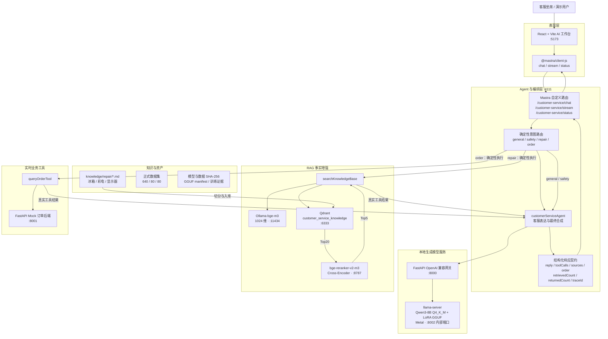
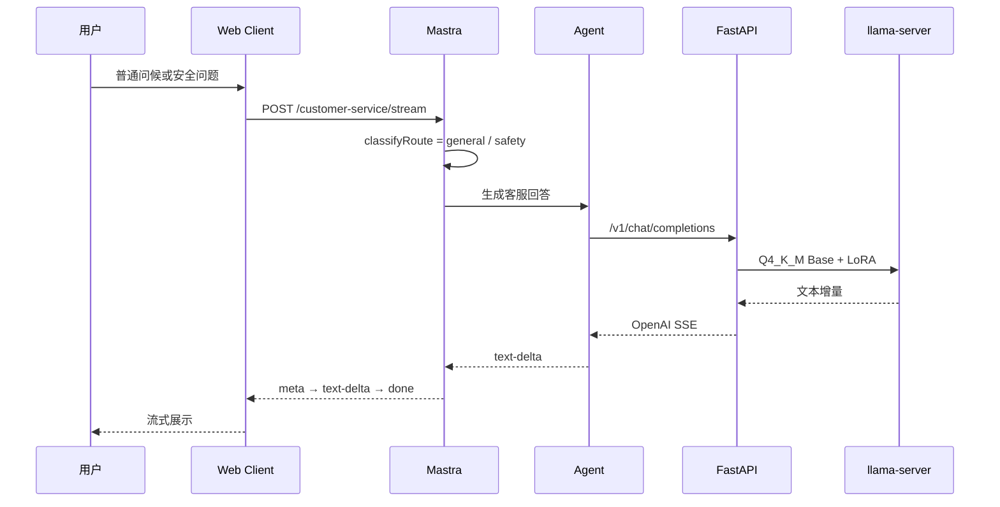
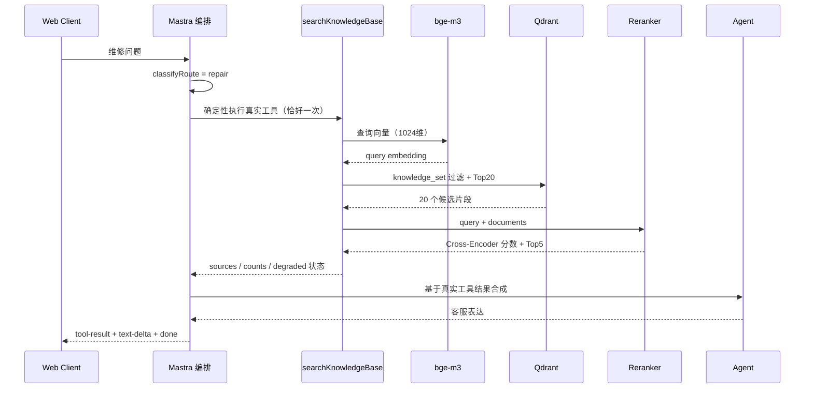
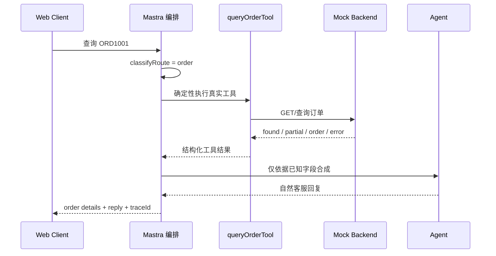
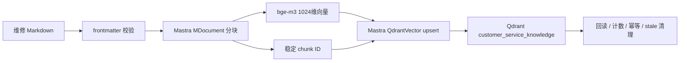
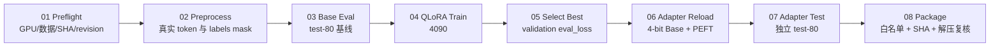

# 智修客服 AI 工作台：完整项目架构

> 文档状态：当前实现的权威架构说明
>
> 对应分支：`agent/commercial-training-and-web-guide`
>
> 基础模型：`Qwen/Qwen3-8B`
> 运行形态：4090 负责一次性 QLoRA 训练，Mac 负责长期本地推理与应用服务

## 1. 项目目标与范围

本项目实现一个可在本地完整运行的家电电商售后客服系统，覆盖课程要求的全部主链路：

- Qwen3-8B 4-bit NF4 QLoRA 微调；
- FastAPI 封装本地模型推理接口；
- Mastra Agent 接入正式 QLoRA 模型接口；
- Mock 订单后端与 `queryOrderTool`；
- 冰箱、彩电、显示器维修知识库；
- Qdrant 向量库与 bge-m3 Embedding；
- Top20 向量召回、Cross-Encoder Reranker、Top5 精排；
- React/Vite 客服工作台通过 Mastra Client 调用 Mastra；
- Base、QLoRA、QLoRA+RAG、QLoRA+RAG+Tools 四档能力证据。

本项目不包含选修的多 Agent、复杂工作流和额外管理后台。

## 2. 核心设计原则

系统严格区分四类职责，避免把动态事实错误地训练进模型：

| 层 | 负责内容 | 不负责内容 |
| --- | --- | --- |
| QLoRA | 客服语气、回答结构、意图识别、澄清追问、安全拒绝、工具结果的自然表达 | 订单实时状态、物流节点、退款进度、维修文档事实 |
| RAG | 维修步骤、风险边界、文档章节、售后知识等可追溯事实 | 实时订单状态、最终业务执行 |
| API / Tools | 订单、物流、退款等实时后端状态 | 通用客服表达风格 |
| System Prompt | 身份、规则、权限、安全边界、不得编造 | 代替检索或实时查询 |

一句话概括：**LoRA 管“怎么答”，RAG 管“事实”，Tools 管“实时状态”，System Prompt 管“规则与边界”。**

## 3. 总体逻辑架构



## 4. 网络边界与端口

| 端口 | 服务 | 访问者 | 边界 |
| ---: | --- | --- | --- |
| 5173 | React/Vite 前端 | 浏览器 | 本地开发页面 |
| 4111 | Mastra Server | 前端 Mastra Client | 前端唯一业务入口 |
| 8000 | FastAPI 模型网关 | Mastra Agent | 模型唯一应用入口 |
| 8001 | Mock 订单后端 | `queryOrderTool` | 前端禁止直连 |
| 8002 | llama-server | FastAPI | 内部推理端口，前端与 Agent 禁止直连 |
| 6333 | Qdrant | RAG 工具 | 前端禁止直连 |
| 8787 | Reranker | RAG 工具 | 前端禁止直连 |
| 11434 | Ollama Embedding | RAG 工具 | 前端禁止直连 |

`web-client/scripts/gate-no-direct.sh` 会扫描前端源码，阻止对 8000、8001、8002、6333、8787、11434 的直接访问。

## 5. 三类请求的运行链路

### 5.1 普通对话与安全请求



安全路由优先于维修关键词，避免“冒烟、焦味、漏电、挂架松动”等高风险场景被普通维修步骤覆盖。

### 5.2 维修 RAG 请求



维修路由由编排层直接调用注册的真实工具实例，不再依赖模型是否遵守 `toolChoice:"required"`。这解决了模型跳过检索、复读和工具名泄漏问题。

### 5.3 订单 Tool 请求



没有订单号时先追问；用户更换订单号时重新执行工具；工具超时、404、500 或字段缺失时不得编造。

## 6. 前端架构

前端位于 `web-client/`，使用 React、Vite、TypeScript、Tailwind 与 `@mastra/client-js`。

### 6.1 页面结构

- 顶栏：品牌、模型/知识库/订单服务四态状态；
- 左栏：会话列表与新建会话；
- 中栏：流式消息、安全卡、订单卡、引用角标和输入区；
- 右栏：执行链路、回答模式、引用来源、traceId 和耗时；
- 响应式：桌面三栏，中等屏幕右栏抽屉，移动端左右双抽屉。

### 6.2 客户端状态机

流式事件契约：

```text
meta → tool-result（可选）→ text-delta* → done
                                   └→ error
```

前端只读取结构化字段，不通过正则解析回答正文来猜测工具、引用或订单状态。

### 6.3 视觉资产

Stitch 最新视觉稿保存在 `frontend-workbench/docs/assets/stitch-v2/`，Feature 9 完成圆角、阴影、毛玻璃顶栏、消息气泡、安全卡、证据面板和输入区视觉升级。输入区不再显示预设快捷问题按钮。

## 7. Agent 与工具架构

`customerServiceAgent` 是正式运行的唯一 Agent，注册两个工具：

| 工具 | 用途 | 真实数据源 |
| --- | --- | --- |
| `searchKnowledgeBase` | 维修与售后事实检索 | Qdrant + bge-m3 + bge-reranker-v2-m3 |
| `queryOrderTool` | 订单、物流与退款状态 | Mock FastAPI 后端 |

`classifyRoute()` 将请求分为：

- `safety`：优先输出安全边界；
- `order`：有订单号时确定性执行订单工具；
- `repair`：确定性执行知识库工具；
- `general`：普通客服表达。

工具执行结果被统一整理为 `ToolCallRecord`，再由 `buildContractExtras()` 生成前端消费的结构化字段。

## 8. RAG 数据架构

### 8.1 知识源

```text
knowledge/repair/
├── refrigerator.md
├── television.md
└── monitor.md
```

每个文档包含 frontmatter、`document_version`、业务域、章节和安全边界。

### 8.2 入库链路



Payload 使用 `knowledge_set` 与 `ingestion_scope` 隔离。检索始终过滤 `knowledge_set=customer-service`，但不限制 scope，从而同时覆盖 repair 和未来 policies。

### 8.3 Rerank 与降级

- 向量召回：Top20；
- 真正的 query-document Cross-Encoder：`bge-reranker-v2-m3`；
- 最终返回：Top5；
- 向量分数与 Rerank 分数不混合；
- Reranker 不可用时明确返回 `degraded` 和原因，不把向量顺序伪装成重排结果。

## 9. 模型训练架构

### 9.1 数据集

| Split | 条数 | 用途 |
| --- | ---: | --- |
| train | 640 | 参数更新 |
| validation | 80 | `eval_loss` 与 checkpoint 选择 |
| test | 80 | 独立终测，绝不参与训练或选 checkpoint |

数据覆盖冰箱、彩电、显示器、订单物流、退换退款、保修安装发票支付、投诉转人工、安全拒绝和提示注入/后端异常。

工具与检索结果使用 `observation` 角色，被 Qwen3 模板编码为 `<tool_response>`，属于 source 段且 label 为 `IGNORE_INDEX`，不作为模型输出目标训练。

### 9.2 QLoRA 配置

| 参数 | 值 |
| --- | --- |
| Base | Qwen3-8B，固定 revision `b968826d...4d91218` |
| 量化 | bitsandbytes 4-bit NF4 + double quant |
| LoRA | rank 16 / alpha 32 / dropout 0.05 / target all |
| Template | `qwen3_nothink` |
| cutoff | 1536 |
| Epoch | 3 |
| Batch | 1，gradient accumulation 8 |
| LR | 1e-4，cosine，warmup 0.1 |
| 精度 | bf16 + gradient checkpointing |

### 9.3 八阶段训练流水线



正式训练选择 `checkpoint-160`，最佳 validation `eval_loss=1.8314380645751953`。

## 10. Mac 推理与模型资产

4090 训练完成后只把正式 Adapter、评测报告和证据包带回 Mac。Mac 不再加载 PyTorch bf16 16GB Base 进行长期推理，而采用 llama.cpp Metal：

| 资产 | 规格 |
| --- | --- |
| Base GGUF | Qwen3-8B `Q4_K_M`，约 5.03GB |
| LoRA GGUF | 正式 Adapter，约 87.3MB，scale 1.0 |
| llama.cpp | commit `11b068d06605288ce7917534b46d52b47823dc13` |
| 推理模式 | `reasoning=off` |
| 加速 | Apple Metal |

受控 manifest 位于 `services/manifests/customer-service-production-v1.gguf.json`，绑定 Base/Adapter SHA-256、基础模型 revision、checkpoint 和 llama.cpp commit。

启动脚本不仅检查进程与 HTTP 200，还核验：

- Base 和 Adapter 文件 SHA-256；
- Adapter basename 与 scale；
- `reasoning_format=none`；
- FastAPI backend 为正式 `llama_cpp`；
- PID、端口与命令行身份，避免误接管或误杀进程。

## 11. FastAPI 推理网关

FastAPI 位于 `services/app.py`，提供 OpenAI 兼容接口并承担以下职责：

- 统一服务端 System Prompt，调用方只能追加说明，不能覆盖安全规则；
- 校验工具白名单，只允许两个正式工具；
- observation 统一映射为上游 `tool` 角色；
- 普通和流式请求透传 llama-server；
- 上游非 2xx 在流开始前转换为明确错误；
- 每次请求验证运行中的 LoRA 身份，异常时 `/health` 返回 degraded。

## 12. 对外数据契约

### 12.1 Chat / Stream

主要字段：

```text
reply
route
toolCalls
sources
reranked
degraded / degradedReason
order.details
retrievedCount / returnedCount
traceId / latencyMs
```

`order.details` 只映射十个经过白名单允许的字段；`found=false` 时不暴露 details。Chat JSON 与 Stream SSE 的 `done` 事件共用同一组装函数，避免字段漂移。

### 12.2 Status

`GET /customer-service/status` 返回：

- `localModel`；
- `knowledgeBase`；
- `orderService`。

每项为 `unknown / online / degraded / error`。探测并发执行、单项超时，响应不暴露 URL、端口、IP、堆栈或主机名。

## 13. 四档能力对比

| 档位 | 模型 | RAG | Tools | 证明重点 |
| --- | --- | --- | --- | --- |
| Base | Qwen3-8B | 无 | 无 | 原始模型客服基线 |
| QLoRA | Base + Adapter | 无 | 无 | 语气、结构、澄清与安全边界 |
| QLoRA + RAG | Base + Adapter | 维修知识库 + Rerank | 无 | 回答有文档事实和引用 |
| QLoRA + RAG + Tools | Base + Adapter | 维修知识库 + Rerank | 订单工具 | 同时具备事实增强与实时状态 |

## 14. 质量保障与安全门禁

### 14.1 数据与训练

- 数据集 SHA-256 三处绑定；
- 严格审计重复、语义泄漏、动态订单事实和危险建议；
- test-80 与训练、验证、checkpoint 选择隔离；
- observation 真实 token 区域必须全部 mask；
- Adapter 白名单打包并解压逐文件复核。

### 14.2 应用与 Agent

- 工具确定性执行且恰好一次；
- 不解析模型正文伪造工具证据；
- Chat/Stream 契约等价；
- 工具失败、空召回、降级都有测试；
- System Prompt 不可被调用方 system 或 observation 覆盖。

### 14.3 前端

- `npm run gates` 聚合类型检查、生产构建、168 项测试和三项门禁；
- 禁止直连内部服务；
- 禁止硬编码 Top20/Top5 展示计数；
- Stitch 资产 SHA-256 校验；
- 前端不根据回答正文猜测执行链路或来源。

## 15. 可观测性与证据

- 每次对话返回 `traceId` 与 `latencyMs`；
- UI 右栏展示路由、工具、检索、重排、引用和安全策略；
- RAG 入库生成幂等报告；
- Base/Adapter 评测保存 JSONL、JSON 与 Markdown；
- `frontend-workbench/specs/acceptance-2026-07-31/ACCEPTANCE-REPORT.md` 保存真实端到端验收记录；
- GitHub Draft Release 保存训练 Adapter 和 GGUF 分片备份，Git 历史不包含大模型权重。

## 16. 仓库目录映射

```text
.
├── configs/                 # LLaMA Factory 训练配置
├── datasets/                # 640/80/80 正式数据、manifest、审计报告
├── scripts/                 # 数据构建、审计与模板验证
├── training/                # 4090 八阶段受控训练流水线
├── knowledge/repair/        # 冰箱、彩电、显示器维修 Markdown
├── services/                # FastAPI、llama.cpp 管理、模型身份验证、评测
├── mastra-agent/            # Agent、Tools、RAG、Reranker、路由和契约
├── web-client/              # React/Vite AI 工作台
├── frontend-workbench/      # Stitch 资产、需求、设计、任务和验收记录
├── adapters/                # Smoke Adapter（正式资产通过备份恢复）
└── docs/                    # 实施方案与完整架构文档
```

## 17. 本地启动依赖顺序

```text
Qdrant + Ollama/bge-m3
        ↓
Reranker
        ↓
Mock Backend + llama-server
        ↓
FastAPI
        ↓
Mastra Server
        ↓
React/Vite Web Client
```

完整联调需要全部服务在线；仅查看页面视觉只需启动 `web-client`。

## 18. 当前边界与后续扩展

当前课程项目已经完成主链路。可选的后续工作包括：

- 增加政策类知识文档与 `policies` scope；
- 增加持久化会话记忆；
- 对 Vite 主包进行代码拆分；
- 增加 CI 与浏览器截图回归；
- 将 Mock 订单后端替换为真实业务 API。

这些扩展均不改变现有职责边界：模型负责表达，RAG 负责事实，工具负责实时状态，规则层负责安全与权限。
